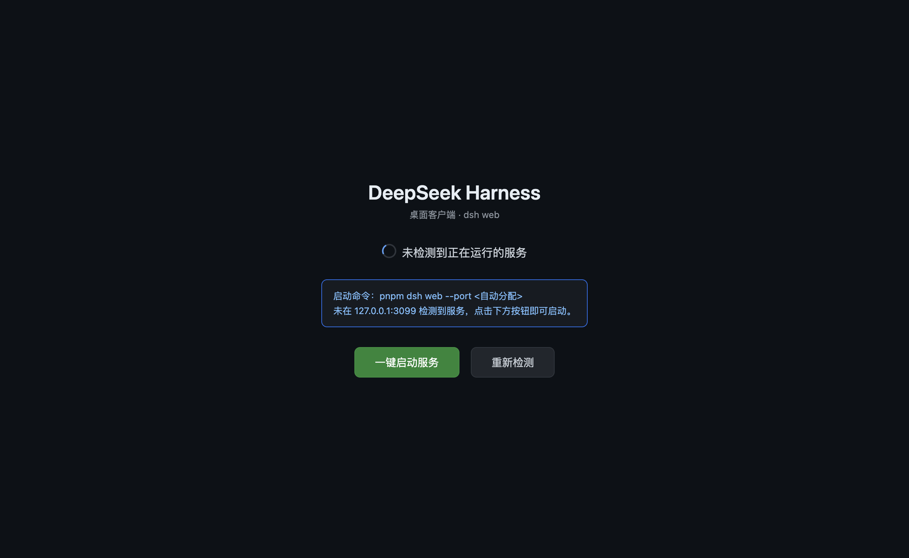

# DeepSeek Harness Desktop

> **English**: [README.en.md](README.en.md) · 更新本文档时请同步修改英文版（README.en.md）。

> 一个轻量的桌面客户端：连接或启动本机的 DeepSeek Harness 服务，在原生窗口中打开 Web GUI。

DeepSeek Harness Desktop 是一个 Electron 桌面壳。它不重新实现任何 Harness 功能，而是管理 `dsh web` 服务的生命周期——**探测**本机是否已有实例、**启动**服务（或让用户一键启动）、**清理**退出时的孤儿进程——然后把 Web GUI 呈现为原生桌面应用。

## 特性

- **自动连接**：检测到本机已有 `dsh web` 实例时直接打开，不重复启动服务
- **一键启动**：没有实例时自动（或点击按钮）启动一个 `dsh web --port 0`，端口由系统分配，无冲突
- **友好的启动器页面**：启动失败、找不到 dsh 时，错误展示在页面内并提供重试/重新检测，不会弹窗退出
- **干净退出**：关闭窗口自动停止自启服务（SIGTERM → SIGKILL），不留孤儿进程
- **体积优化**：打包时裁剪 Electron 语言包，macOS 安装包 103MB
- **开源**：MIT License

## 界面预览

启动器页面（检测服务 / 一键启动 / 重试）：

## 安装

从 [GitHub Releases](https://github.com/kimirong/deepseek-harness-desktop/releases) 下载 `DeepSeek Harness-<版本>-arm64.dmg`，打开后将应用拖入「应用程序」文件夹。

> **系统要求**
>
> - macOS 13+（Apple Silicon, arm64）
> - 本机已安装可用的 `dsh`（或通过环境变量 `DSH_BIN` 指定路径）
> - 首次打开若提示"未验证的开发者"：系统设置 → 隐私与安全性 → 仍要打开

## 快速开始

1. 下载并安装 dmg（见上）
2. 打开「DeepSeek Harness」
3. 应用自动检测本机服务：有则直达，没有则显示「一键启动」按钮，点击即启动并进入

## 使用说明

| 场景 | 行为 |
|---|---|
| 本机已有 `dsh web` 实例（默认 3080） | 自动连接，不重复启动 |
| 没有实例、已装 dsh | 自动启动，或点击「一键启动服务」 |
| 启动失败 | 页面显示错误详情 +「重试启动」+「重新检测」 |
| 未找到 dsh | 页面给出配置指引 +「重新检测」 |
| 服务运行中意外退出 | 回到启动器页面，可重试 |

常用配置（环境变量）：

| 变量 | 默认 | 说明 |
|---|---|---|
| `DSH_BIN` | — | 指定 `dsh` 可执行文件路径（打包安装时用） |
| `DSH_SHELL_PORT` | `3080` | 探测端口：连接已运行实例时用 |
| `DSH_SHELL_AUTO_START` | `1` | 设 `0` 则不自动启动，只显示「一键启动服务」按钮 |

完整变量表见[开发者文档](docs/DEVELOPMENT.md)。

## 平台支持

| 平台 | 状态 |
|---|---|
| macOS（Apple Silicon, arm64） | ✅ 已发布 |
| Windows（win64） | ⚠️ 代码已兼容，**未在真机验证、未发布** |
| Linux | ❌ 未支持 |

## 已知限制

- **仅本机使用**：Harness 默认只监听 `127.0.0.1`（安全红线，源码显式拒绝 `--host 0.0.0.0`），本客户端不做远程访问
- **未签名**：安装包为本地未签名构建，首次打开需在系统设置中手动允许
- **Windows 未验证**：运行时行为尚未在 Windows 真机实测，发行版暂不含 Windows 安装包

## 路线图

- [ ] Windows 真机验证并发布安装包
- [ ] Linux 支持
- [ ] 体积优化路线：electron-updater 差量更新 / Tauri 迁移评估（见[开发者文档](docs/DEVELOPMENT.md)）

## 开发者

构建、测试、打包指引见[开发者文档](docs/DEVELOPMENT.md)。Tauri 迁移工作量评估见 [docs/tauri-migration.md](docs/tauri-migration.md)。

## 贡献

欢迎协作！无论是修复 bug、补充功能、完善文档，还是帮我们在 **Windows / Linux 真机上做验证**（目前仅 macOS 验证过）。

请通过 [GitHub Issues](https://github.com/kimirong/deepseek-harness-desktop/issues) 反馈，或直接提交 Pull Request。

## 许可

[MIT](LICENSE) © 2026 kimirong
