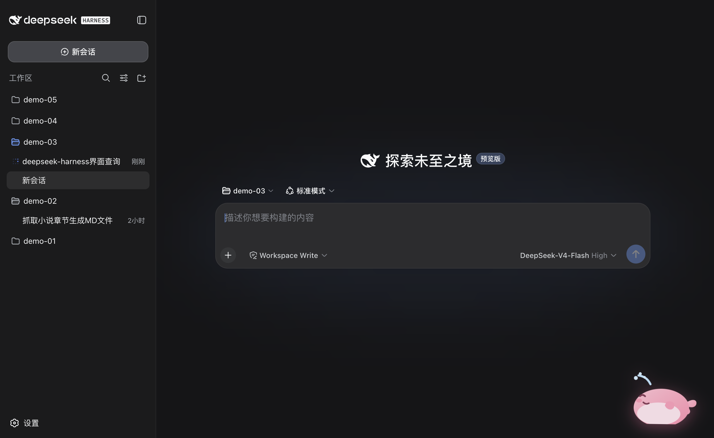
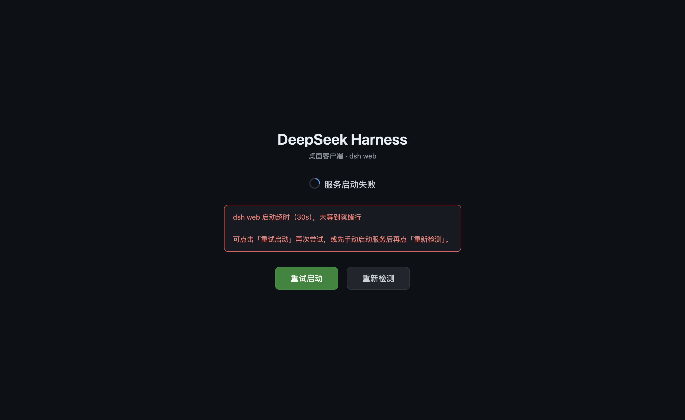
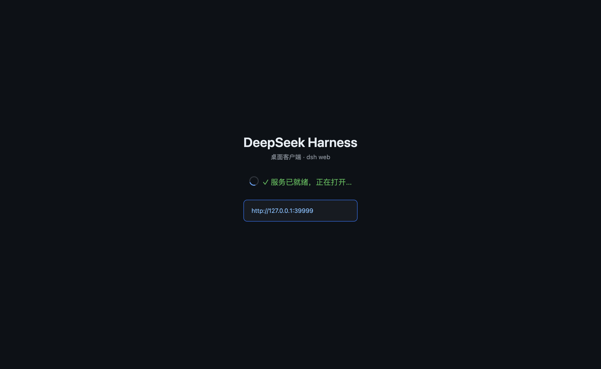
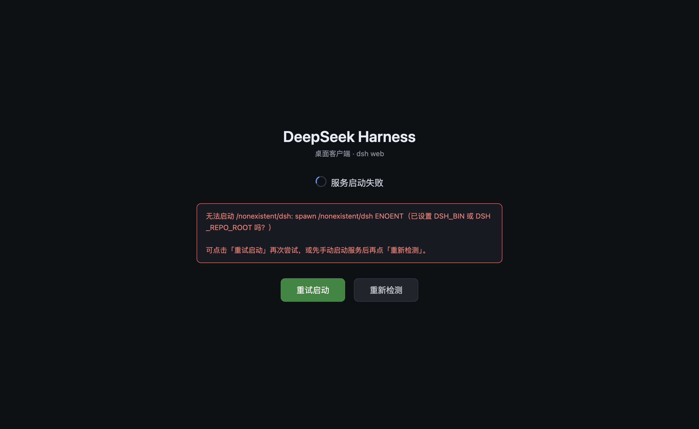
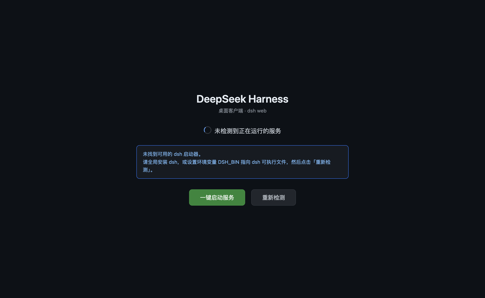

<h1 align="center">
  
  <br />
  DeepSeek Harness Desktop
</h1>

<p align="center">
  A minimal, local-first desktop shell for
  <a href="https://github.com/deepseek-ai/deepseek-harness">DeepSeek Harness</a>.
</p>

<p align="center">
  <a href="#简体中文">简体中文</a> · <a href="#english">English</a>
</p>

<p align="center">
  <a href="https://github.com/kimirong/deepseek-harness-desktop/releases/latest"></a>
  <a href="LICENSE"></a>
  
  
</p>



<a id="简体中文"></a>

## 简体中文

DeepSeek Harness Desktop 将 DeepSeek Harness Web 体验封装为独立桌面应用：自动探测本机服务、一键启动、退出时清理——无需手动操作 CLI 或管理端口。

本项目专注于桌面宿主能力，不 fork、不修改、不注入，也不重新实现 Harness UI。模型、会话、设置、插件和 Agent 能力均由本机安装的官方 `@deepseek-ai/dsh` 提供。

> [!IMPORTANT]
> 本项目是非官方社区封装，早期版本。安装包未签名、未公证（macOS 首次打开需在「系统设置 → 隐私与安全性」中允许）。Windows 版本尚未在真机验证，暂未发布。

### 下载

| 平台 | 架构 | 安装包 | 下载 |
| --- | --- | --- | --- |
| macOS | Apple Silicon | DMG | [下载 arm64 版本](https://github.com/kimirong/deepseek-harness-desktop/releases/latest/download/DeepSeek.Harness-0.1.0-arm64.dmg) |
| Windows | x64 | — | 未验证、未发布（见[已知限制](#已知限制)） |

全部当前和历史安装包可在 [GitHub Releases](https://github.com/kimirong/deepseek-harness-desktop/releases) 查看。

### 为什么需要桌面版

DeepSeek Harness 已经提供完整的 Agent Runtime 和 Web UI。本项目不重复实现这些能力，而是补充桌面应用所需的宿主层：

- 自动探测本机已有的 Harness 服务并直接连接
- 没有实例时自动启动（或一键启动）`dsh web`，使用随机回环端口
- 等待服务就绪后再进入界面，启动失败不弹窗、可重试
- 应用退出时自动终止自启的子进程，不留孤儿进程

### 主要特性

- 自动连接已运行的 Harness 实例，不重复启动服务
- 启动器页面覆盖全部"服务未运行"场景：一键启动、进度提示、错误重试、配置指引
- 服务仅监听随机本地回环端口，不暴露到局域网
- 渲染进程启用沙箱、`contextIsolation`，禁用 Node.js 集成
- 连接已有实例时为只读连接，不接管其生命周期
- 打包时裁剪 Electron 语言包，安装包 103MB

### 界面预览

使用流程（打开应用 → 一键启动 → 进入界面）：

| 步骤 | 界面 | 说明 |
|---|---|---|
| 1. 检测 |  | 打开应用，未检测到本机服务：显示「一键启动服务」按钮 |
| 2. 启动 |  | 点击后启动 `dsh web`（随机回环端口），显示进度 |
| 3. 就绪 |  | ✓ 服务已就绪，即将打开 GUI |
| 4. 进入 |  | 进入完整的 DeepSeek Harness 界面 |

异常场景：

| 界面 | 说明 |
|---|---|
|  | 启动失败：错误详情 +「重试启动」+「重新检测」 |
|  | 未找到 dsh：配置指引 +「重新检测」 |

### 安装说明

#### macOS

安装包为本地未签名构建。首次启动：

1. 打开 DMG，将 **DeepSeek Harness** 拖入「应用程序」。
2. 尝试打开应用；若 macOS 阻止启动，点击「完成」。
3. 打开「系统设置 → 隐私与安全性」。
4. 在「安全性」区域找到 DeepSeek Harness，点击「仍要打开」。
5. 再次点击「打开」确认。该确认通常只需一次。

前置要求：本机已安装可用的 `dsh`（或通过环境变量 `DSH_BIN` 指定路径）。

### 使用说明

| 场景 | 行为 |
|---|---|
| 本机已有 `dsh web` 实例（默认 3080） | 自动连接，不重复启动 |
| 没有实例、已装 dsh | 自动启动，或点击「一键启动服务」 |
| 启动失败 | 页面显示错误详情 +「重试启动」+「重新检测」 |
| 未找到 dsh | 页面给出配置指引 +「重新检测」 |
| 服务运行中意外退出 | 回到启动器页面，可重试 |

常用配置（环境变量）：

| 变量 | 默认 | 说明 |
|---|---|---|
| `DSH_BIN` | — | 指定 `dsh` 可执行文件路径 |
| `DSH_SHELL_PORT` | `3080` | 探测端口：连接已运行实例时用 |
| `DSH_SHELL_AUTO_START` | `1` | 设 `0` 则不自动启动，只显示「一键启动服务」按钮 |

完整变量表见[开发者文档](docs/DEVELOPMENT.md)。

### 运行架构

```text
DeepSeek Harness Desktop
├── Electron Main
│   ├── 探测已有实例（127.0.0.1:3080）
│   ├── 一键启动 / 自动启动 dsh web
│   ├── 子进程生命周期与退出清理
│   └── 随机回环端口与就绪检测
│
├── dsh web 子进程（本机已安装的 @deepseek-ai/dsh）
│   └── http://127.0.0.1:<random-port>
│
└── Sandboxed BrowserWindow
    └── DeepSeek Harness Web UI
```

### 安全模型

- Harness 服务仅绑定 `127.0.0.1`（源码显式拒绝 `--host 0.0.0.0`，安全红线）
- 渲染进程禁用 Node.js 集成，启用 `contextIsolation` 与 Chromium sandbox
- 连接已有实例时为只读连接，壳不杀死非自启的服务
- 应用退出时自动终止自启子进程（SIGTERM → SIGKILL；Windows 用 `taskkill /T` 杀进程树）

### 验证状态

| 平台 | 构建 | 打包后启动 | Web UI |
| --- | --- | --- | --- |
| macOS Apple Silicon | DMG 通过 | 通过 | HTTP 200 |
| Windows x64 | ZIP 交叉构建通过 | 未验证 | 未验证 |
| Linux | 未支持 | — | — |

### 已知限制

- 壳不内置 Harness 运行时，需要本机已安装 `dsh`
- macOS 安装包未签名、未公证，首次打开需手动允许
- Windows 尚未真机验证、未发布安装包
- Linux 未支持
- 尚未集成自动更新

### 路线图

- [ ] Windows 真机验证并发布安装包
- [ ] Linux 支持
- [ ] 体积优化：electron-updater 差量更新 / Tauri 迁移（见[开发者文档](docs/DEVELOPMENT.md)）

### 贡献

欢迎协作！无论是修复 bug、补充功能、完善文档，还是帮我们在 **Windows / Linux 真机上做验证**（目前仅 macOS 验证过）。

请通过 [GitHub Issues](https://github.com/kimirong/deepseek-harness-desktop/issues) 反馈，或直接提交 Pull Request。

### 上游版本与许可

桌面封装采用 [MIT License](LICENSE)。应用图标使用上游 DeepSeek Harness Web favicon 中的鲸鱼图案。

本项目与 DeepSeek 不存在隶属或官方合作关系。DeepSeek Harness 及相关名称的权利归其各自所有者所有。

开发者指引见 [docs/DEVELOPMENT.md](docs/DEVELOPMENT.md)。

---

<a id="english"></a>

## English

DeepSeek Harness Desktop packages the DeepSeek Harness Web experience as a standalone desktop app: it probes for a local server, starts it with one click, and cleans up on exit — no manual CLI or port management needed.

This project focuses on desktop hosting. It does not fork, modify, inject into, or reimplement the Harness UI. Models, sessions, settings, plugins, and agent capabilities remain provided by the official `@deepseek-ai/dsh` installed on your machine.

> [!IMPORTANT]
> This is an unofficial community wrapper and an early-stage project. The installers are unsigned and not notarized (macOS requires approval in System Settings on first launch). Windows is not yet verified on real hardware and is not released.

### Download

| Platform | Architecture | Package | Download |
| --- | --- | --- | --- |
| macOS | Apple Silicon | DMG | [Download for Apple Silicon](https://github.com/kimirong/deepseek-harness-desktop/releases/latest/download/DeepSeek.Harness-0.1.0-arm64.dmg) |
| Windows | x64 | — | Not verified, not released (see [Known limitations](#known-limitations)) |

All current and historical packages are on the [GitHub Releases page](https://github.com/kimirong/deepseek-harness-desktop/releases).

### Why this project exists

DeepSeek Harness already provides the complete agent runtime and Web UI. This project supplies the host capabilities required for a desktop product:

- Probe for an already-running local Harness instance and connect directly
- Start `dsh web` automatically (or with one click) on a random loopback port when none is running
- Wait for readiness before opening the UI; on failure show retry instead of a dialog
- Terminate self-started child processes on exit, leaving no orphans

### Features

- Auto-connects to a running Harness instance without duplicating the server
- Boot screen covers every "server not running" case: one-click start, progress, error retry, setup guidance
- Server listens only on a random local loopback port, never exposed to the LAN
- Renderer is sandboxed with `contextIsolation`, Node.js integration disabled
- Read-only connection to existing instances — never takes over their lifecycle
- Electron locale files are stripped at package time; the macOS installer is 103 MB

### Preview

The user flow (open the app → one-click start → enter the UI):

| Step | Screen | Notes |
|---|---|---|
| 1. Detect |  | No local server found — "Start server" button |
| 2. Start |  | Starts `dsh web` on a random loopback port, shows progress |
| 3. Ready |  | ✓ Server ready, opening the GUI |
| 4. Enter |  | Full DeepSeek Harness interface |

Edge cases:

| Screen | Notes |
|---|---|
|  | Start failure — error details + "Retry start" + "Re-detect" |
|  | `dsh` not found — setup guidance + "Re-detect" |

### Installation

#### macOS

The installer is a locally built, unsigned binary. On first launch:

1. Open the DMG and drag **DeepSeek Harness** into **Applications**.
2. Try to open the app; if macOS blocks it, click **Done**.
3. Open **System Settings → Privacy & Security**.
4. Find DeepSeek Harness in the **Security** section and click **Open Anyway**.
5. Confirm by clicking **Open** once more. This is normally required only once.

Prerequisite: a usable `dsh` must be installed locally (or pointed to via the `DSH_BIN` environment variable).

### Usage

| Scenario | Behavior |
|---|---|
| A `dsh web` instance is already running (default port 3080) | Auto-connects, no duplicate server |
| No instance, `dsh` installed | Auto-starts, or press "Start server" |
| Start failure | Error details + "Retry start" + "Re-detect" on the page |
| `dsh` not found | Setup guidance + "Re-detect" on the page |
| Server exits unexpectedly | Back to the boot screen, can retry |

Common configuration (environment variables):

| Variable | Default | Purpose |
|---|---|---|
| `DSH_BIN` | — | Path to the `dsh` executable |
| `DSH_SHELL_PORT` | `3080` | Probe port used to connect to a running instance |
| `DSH_SHELL_AUTO_START` | `1` | Set `0` to disable auto-start and only show the "Start server" button |

See the [developer docs](docs/DEVELOPMENT.md) for the full variable list.

### Runtime architecture

```text
DeepSeek Harness Desktop
├── Electron Main
│   ├── Probe for an existing instance (127.0.0.1:3080)
│   ├── One-click / auto start of dsh web
│   ├── Child-process lifecycle and exit cleanup
│   └── Random loopback port and readiness checks
│
├── dsh web child process (locally installed @deepseek-ai/dsh)
│   └── http://127.0.0.1:<random-port>
│
└── Sandboxed BrowserWindow
    └── DeepSeek Harness Web UI
```

### Security model

- The Harness server binds only to `127.0.0.1` (the source explicitly rejects `--host 0.0.0.0`, a security red line)
- Node.js integration is disabled in the renderer; `contextIsolation` and the Chromium sandbox are enabled
- Connecting to an existing instance is read-only — the shell never kills a server it did not start
- On exit, self-started child processes are terminated (SIGTERM → SIGKILL; `taskkill /T` process-tree kill on Windows)

### Validation status

| Platform | Packaging | Packaged startup | Web UI |
| --- | --- | --- | --- |
| macOS Apple Silicon | DMG passed | Passed | HTTP 200 |
| Windows x64 | ZIP cross-build passed | Not verified | Not verified |
| Linux | Not supported | — | — |

### Known limitations

- The shell does not bundle the Harness runtime; a local `dsh` installation is required
- The macOS installer is unsigned and not notarized; first launch needs manual approval
- Windows is not verified on real hardware and no installer is released yet
- Linux is not supported
- Automatic updates are not integrated

### Roadmap

- [ ] Verify on real Windows hardware and release the Windows installer
- [ ] Linux support
- [ ] Size roadmap: electron-updater delta updates / Tauri migration (see the [developer docs](docs/DEVELOPMENT.md))

### Contributing

Contributions are welcome! Whether it is fixing bugs, adding features, improving docs, or helping us **verify on real Windows / Linux machines** (currently only macOS is verified).

Please open a [GitHub Issue](https://github.com/kimirong/deepseek-harness-desktop/issues) or submit a pull request directly.

### Upstream version and license

The desktop wrapper is available under the [MIT License](LICENSE). The application icon uses the whale artwork from the upstream DeepSeek Harness Web favicon.

This project is not affiliated with or endorsed by DeepSeek. DeepSeek Harness and related names belong to their respective owners.

Developer guide: [docs/DEVELOPMENT.md](docs/DEVELOPMENT.md).
